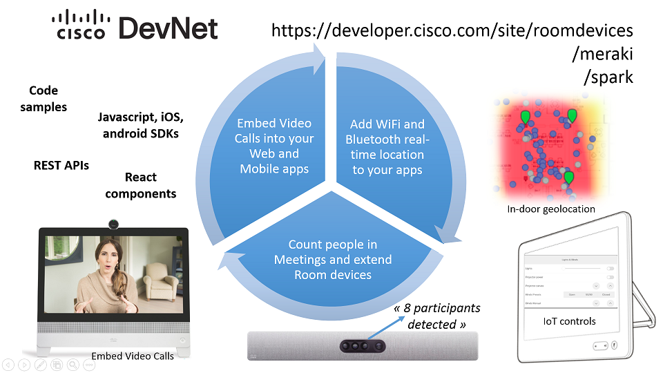
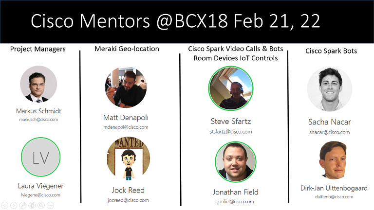
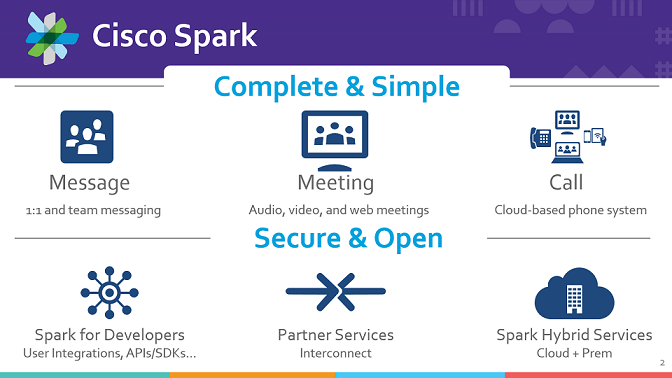
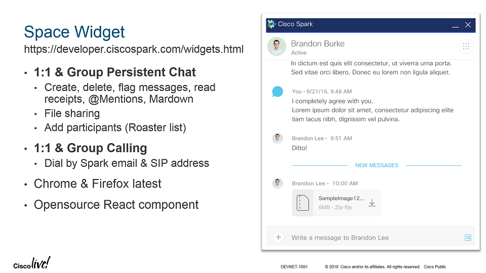
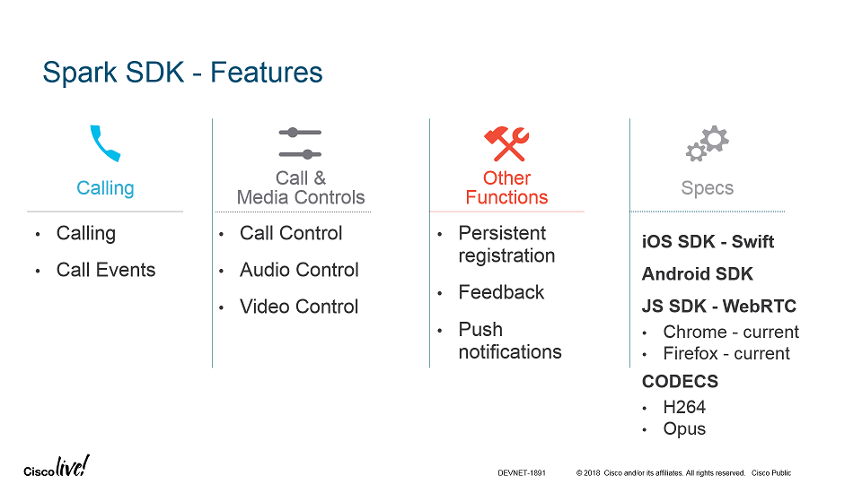
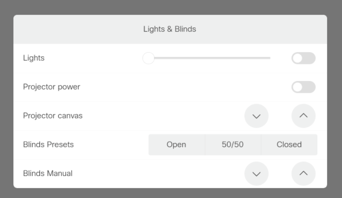

# Bosch Connected eXperience 2018 (Berlin Feb 21,22)

Welcome to the Cisco Technical Resources repo for BCX18.
You'll find hereafter developer resources to quickly get started with Cisco technologies and APIs:

  - [Connected Life Challenge at BCX18](#connected-life-challenge): Note that the Cisco technologies can be used for other challenges
  - [Cisco Supporting Team and Technologies](#cisco-supporting-team)
  - [Cisco Spark Starter Kit](#cisco-spark-starter-kit): Embed Video Calls into Web and Mobile Apps
  - [Room Devices Starter Kit](#room-devices-starter-kit): Add custom UI controls and track activity in Meeting Rooms
  - [Meraki Starter Kit](#meraki-starter-kit): Add Wifi and bluetooth real-time location to your apps
 

## Connected Life Challenge

BCX18 is a [two-day IoT hackathon](http://bcw.bosch-si.com/berlin/hackathon/) for backend and frontend developers, product owners, product managers, UX experts, and innovators from Bosch customers, partners, and start up companies. More than 700+ developers are invited to compete in many different challenges, ranging from mobility and autonomous driving, to manufacturing and connected homes and buildings.

The [Connected Life Hack Challenge](http://bcw.bosch-si.com/berlin/connected-life/) is about connected agriculture to smart cities: Would you like to make our lives easier and more comfortable, while staying focused on your passion? From farm to fork, from bed to work – we provide you with the framework to realize your ideas. We will supply the necessary hardware and software to build solutions for a connected life. You will be able to easily and professionally create IoT applications for farmers, building stakeholders, boroughs, sharing communities, construction companies and residents. Join this hack challenge and do your best for rural and urban areas!

_Note that the Cisco technologies described below may be used for other challenges_

## Cisco Supporting Team and Technologies

**We brought innovative and easy to embed technologies via APIs and SDKs, and supported by a group of experts**

**[Click here to join the Mentoring Space](https://eurl.io/#r1UD8QJPM): enter your email address and start chating with the mentors.**

The **[Cisco Spark SDKs and Widgets](https://developer.ciscospark.com/sdks-and-widgets.html)** provide the easiest way for developers to embed high quality audio-video calling and messaging into Web, iOS and Android applications. Note that you can also create Chat Bots to create quick human interactions and control IoT devices, or simply push messages as events are happening.

**[Cisco Room Devices](https://projectworkplace.cisco.com/#/product/sparkroomkit/0/0)** will let you capture activity in Meeting rooms via REST APIs or the jsxapi Node.js SDK. It does also let you quickly add custom UI controls to take action straight from where the meeting is happening: control lights, change Camera streams and orientations, fire commands or receive events to Raspberry Pis).

**[Meraki access points](https://documentation.meraki.com/MR/Monitoring_and_Reporting/Location_Analytics)** will let use the intelligence in the wireless network and view location information, dwell times, and analytics in a delimited zone.

## Cisco Spark Starter Kit

**[Embed Video Calls via the Javascript, Android or iOS SDKs or leverage the ready-to-use React Widgets](https://developer.ciscospark.com/sdks-and-widgets.html)**

Background info: the Cisco Spark free plan gives you illimited Chating, and Video calls with up to 3 members (Chat, Video, Shared-board), so that everything you will learn during the hackathon about Spark API, you can reuse after.
Moreover, Spark API support is freely accessible 24/24, 7/7, via [email and #spark4devs room](https://developer.ciscospark.com/support.html)

To start with Cisco Spark:
- Sign up for [Cisco Spark](https://www.ciscospark.com/) and reach to the [Cisco Spark Web client](https://web.ciscospark.com/)
- [optional] [Install a Spark client](https://www.ciscospark.com/downloads.html) on your laptop and/or mobile phone, and get instant access from all your devices
- Sign in at [Spark for Developers](https://developer.ciscospark.com) with your Spark account credentials (same as the ones above). This is where you'll get your API developer access token.

Here are a few learning resources:
- Check these learning labs for step-by-step tutorials [Cisco Spark Learning Track](https://learninglabs.cisco.com/tracks/collab-cloud) to learn to create Cisco Spark Bots and OAuth integrations.
- Check the [awesome-ciscospark resources](https://github.com/CiscoDevNet/awesome-ciscospark) to get code samples and SDKs in various programming languages,
- Connect with other bot builders through the [Sparkers' Community on DevNet](https://developer.cisco.com/site/spark).

### Embedding Video Calls

**[Check the widget code samples](https://github.com/CiscoDevNet/widget-samples): paste your Cisco Spark access token and the ready-to-use widget samples**

[Spark Widgets](https://developer.ciscospark.com/widgets.html): Integrate Spark functionality into your existing web apps with Widgets written in React
- Space Widget: Calling (Audio and video 1:1 calling) and Messaging (Space and 1:1 messaging, Markdown support, File sharing, Message flags and ability to delete messages, Read receipts, Persistent chat),
- Recents Widget: Recent Spark conversation list (spaces & people), Hooks to open a conversation with the Space Widget, Unread space highlighting, Event hooks for messages, calls, and memberships, Incoming call notifications

**[Take the Space Widget quick start](https://developer.cisco.com/site/spark)**

[Spark SDK for JS](https://developer.ciscospark.com/sdk-for-javascript.html): Integrate Cisco Spark calling into your JavaScript applications. Place and receive video calls via the SDK: 
- Audio/Video calls (Group and 1-1)
- Dial by email or SIP address
- Call and event controls, including DTMF
- Supported on Chrome and Firefox latest versions

[Spark SDK for iOS](https://developer.ciscospark.com/sdk-for-ios.html): Integrate Cisco Spark calling into your iOS apps. Place and receive Spark video calls: 
- Audio/Video calls (Group and 1-1)
- Dial by email or SIP address
- Call and event controls, including DTMF

[Spark SDK for Android](https://developer.ciscospark.com/sdk-for-android.html): Integrate Cisco Spark calling into your Android apps. Place and receive Spark video calls: 
- Audio/Video calls (1-1 only)
- Dial by email or SIP address
- Call and event controls, including DTMF
- Supported on Chrome and Firefox latest versions

### Creating Chat Bots

Take the [Create conversational bots with Botkit](https://developer.ciscospark.com/samples-tutorials.html) tutorial.

Don't miss the existing [Cisco Spark Starter Kits](https://ciscosparkambassadors.github.io/StarterKits/) to quickly create chat bots.

## Room Devices Starter Kit

**Two [Cisco Spark Room Kits](https://projectworkplace.cisco.com/#/product/sparkroomkit/0/0) have been installed in the hackathon space, contact the on-site support team to get access to the devices.**

The RoomKits let you get instant face counting, and deploy custom controls from the Touch10 panel attached to the device.

To start with the room devices, take the [Intro to xAPI Learning Lab](https://learninglabs.cisco.com/lab/collab-xapi-intro/step/1).

Then, check the provided [developer resources and samples on the Dev Center](https://developer.cisco.com/site/roomdevices):
- [Official Macro samples](https://github.com/CiscoDevNet/roomdevices-macros-samples) 
- [More Macros, Controls and Node.js samples](https://github.com/ObjectIsAdvantag/xapi-samples)
- [Postman collections for xAPI](https://github.com/CiscoDevNet/postman-xapi)

You're all set to start detecting real-time activity from the Devices's camera such as People Count, and deloying custom controls on the Touch10 panels of the site.

## Meraki Starter Kit

**Four access points have been setup in the hackathon space**

Contact the on-site support team to get access to the geolocation data.

[TODO] Add developer resources and samples
