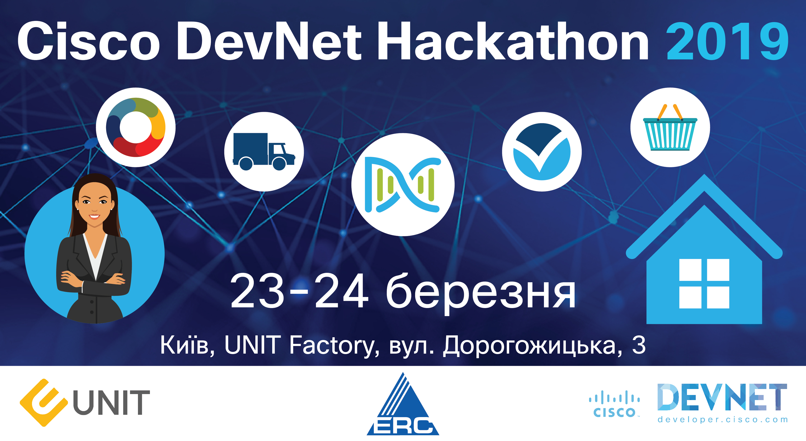
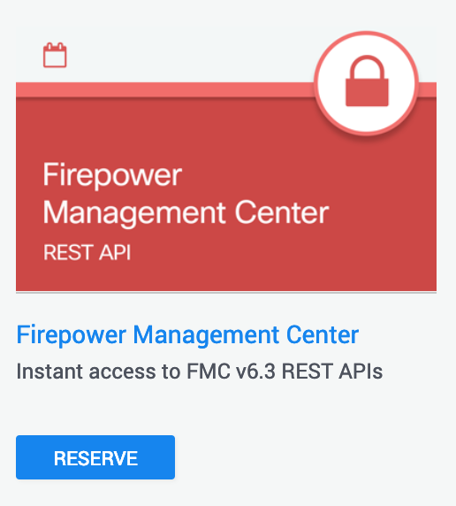
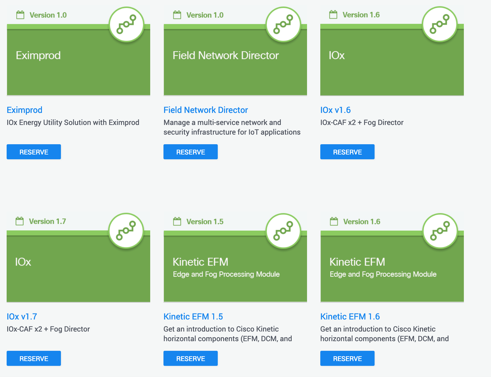

# Cisco DevNet Hackathon 2019 (Kyiv, Ukraine | 23-24 March)

Welcome to the Cisco Technical Resources repo for cdh19-kyiv.
In this repo you'll find developer resources to quickly get started with Cisco technologies and APIs.

Registration and schedule of the hackathon you can find [here](https://www.cisco.com/c/m/uk_ua/training-events/2018/hackathon/index.html)

This workshop requires: 
 - Cisco DevNet account, register [by link](https://developer.cisco.com/join/kyiv0319) 
 - Webex Team account – sign up at [https://www.webex.com/](https://www.webex.com/) Communication through [this Webex space](https://eurl.io/#BJaDYXtPN)  

To access some sandbox/services you will need to use Cisco AnyConnect:
 - For Mac and Windows, you can download [here](https://developer.cisco.com/site/sandbox/anyconnect/)
 - For Linux, install OpenConnect, [see here](https://developer.cisco.com/learning/modules/dev-setup/dev-ubuntu/step/7)
 

_Your final task is to show the prototype of an application/program/script that extends or complements the capabilities of Cisco products and solutions._

You can choose one (main) directions:

  - [Wireless programmability](#цireless-programmability)
  - [Networking](#networking)
  - [Security](#security)
  - [IoT](#iot)
  

## Wireless programmability

CMX location & CMX Presence (Connected Mobile Experiences). On-site there will be live instances that connected to Wi-Fi architecture of [UNIT Factory](https://unit.ua/en/) 

You can also use CMX or Meraki sandboxes to prepare and test your prototypes:
  - [CMX location](https://devnetsandbox.cisco.com/RM/Diagram/Index/3f3178e9-8c8e-4b9a-9ced-689602d493cb?diagramType=Topology)
  - [Meraki Small Business](https://devnetsandbox.cisco.com/RM/Diagram/Index/aa48e6e2-3e59-4b87-bfe5-7833c45f8db8?diagramType=Topology)
  
_Note that the Cisco technologies described below may be used for other challenges_

## Networking

Available [sandboxes by Networking category](https://devnetsandbox.cisco.com/RM/Topology?c=14ec7ccf-2988-474e-a135-1e90b9bc6caf)

In this direction you can also use DNA-C (Digital Network Architecture Center) sandboxes

DNA-C 1.2.10 - [https://sandboxdnac2.cisco.com/](https://sandboxdnac2.cisco.com/)

login: devnetuser

password: Cisco123!

DNA-C 1.2.6 - [https://sandboxdnac.cisco.com](https://sandboxdnac.cisco.com)

login: devnetuser

password: Cisco123!

## Security

Available [sandboxes by Security category](https://devnetsandbox.cisco.com/RM/Topology?c=a6f8430c-5b24-439d-b28a-effb42d4c20c)

In this direction you can also use Cisco DevNet [FMC REST API Sandbox with FMC v6.3](https://devnetsandbox.cisco.com/RM/Diagram/Index/1228cb22-b2ba-48d3-a70a-86a53f4eecc0?diagramType=Topology)

### IoT

Available [sandboxes by IoT category](https://devnetsandbox.cisco.com/RM/Topology?c=171f6448-a74a-4831-a8c5-ad6f681bfc0d)

**Other Useful links**

- [Cisco DevNet Modules](https://developer.cisco.com/learning/modules)
- [Discover code repositories related to Cisco technologies](https://developer.cisco.com/codeexchange/)
- [Cisco Ecosystem Exchange](https://developer.cisco.com/ecosystem)
- [Cisco DevNet github](https://github.com/CiscoDevNet)
- [Sandbox Labs](https://devnetsandbox.cisco.com/RM/Topology)

