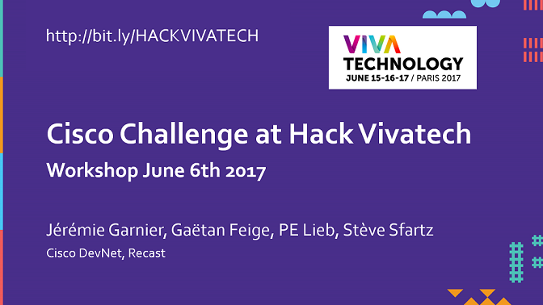
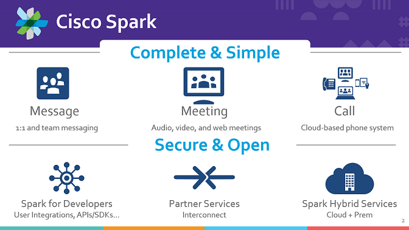
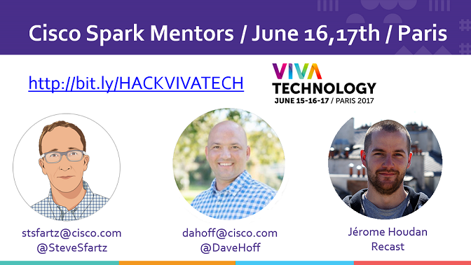
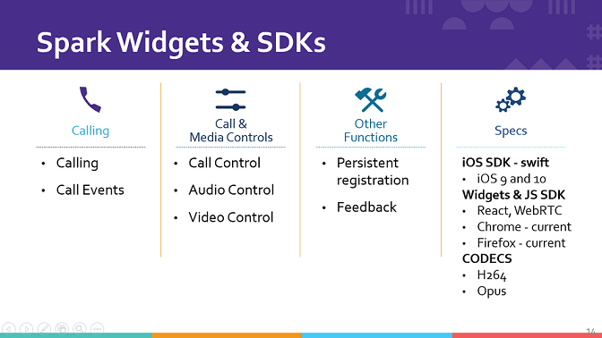

# Hack Vivatech (Paris June 16th, 17th)

## What is it ?

A [25-hours marathon](https://vivatechnology.com/hackathon/) of product development, where diverse ideas collide and the best ones emerge as a new product or service. 

It’s a madhouse of creative fun, with coding and marketing working together in teams for accelerated productivity. 

Shine in front of tech leaders presenting your project "on stage".

## Cisco Challenge

**Event Experience: Reimagine the Digital Experience of Vivatech Attendees**

Use the intelligence in your wireless network CMX and view location information, dwell times, and analytics to learn how visitors behave.

Cisco Spark SDKs and Cisco Spark Widgets provide the easiest way for developers to embed high quality audio-video calling and messaging into any web or native application.

You can also create Spark Bots to automate routine tasks and inject contextual content into groups, meetings and conversations. Thanks to https://recast.ai/, enhance your bot with natural language processing.

**<a href="docs/workshop.pdf" target="_blank">Check the workshop slides</a>**
and if you want to access the recording of the meetup session, follow this [link](https://cisco.webex.com/ciscosales/lsr.php?RCID=919a134e5e6049cc8f9a7e1da20211c6) with password cA5Yi9Tc

## Cisco Spark Starter Kit

**Cisco Spark trial plan gives you free Chating, Audio & Video calls to other Spark users, and meetings with up to 3 members (Chat, Video, Shared-board), 
everything you will learn during the hackathon about Spark API, you can reuse after.
Moreover, Spark API support is free, 24/24, 7/7, via [email and #spark4devs room](https://developer.ciscospark.com/support.html)**

- Sign up for [Cisco Spark](https://www.ciscospark.com/) and reach to [Cisco Spark Web client](https://web.ciscospark.com/)
- [optional] [Install a Spark client](https://www.ciscospark.com/downloads.html) on your laptop and/or mobile phone, and get instant access from all your devices
- Sign in at [Spark for Developers](https://developer.ciscospark.com) with your Spark account credentials (same as the ones above). This is where you'll get your API access token.

- Take the  [Cisco Spark Learning Track](https://learninglabs.cisco.com/tracks/collab-cloud) to learn to automate Cisco Spark and create Cisco Spark Applications (bots, OAUTH integrations).
- Take the [Using Rooms & Messages Learning Lab](https://developer.ciscospark.com/samples-tutorials.html) at DevNet - Cisco Developer Network,
- [optional] import the [Postman collection](https://github.com/CiscoDevNet/postman-ciscospark) for CiscoSpark to quickly generate code,

- Check the [awesome-ciscospark resources](https://github.com/CiscoDevNet/awesome-ciscospark) to get code samples and SDKs in various programming languages,

- Connect with other bot builders through the [Sparkers'community on devNet](https://developer.cisco.com/site/spark).

**[Click to join the Mentoring Space](https://eurl.io/#rJ0s6PVMb): enter your email address and start chating with the mentors.**

### Cisco Spark Bots

- Do it yourself by [experimenting a Cisco Spark bot](https://github.com/ObjectIsAdvantag/sparkbot-webhook-samples) and [get inspired from several BotKit samples](https://github.com/CiscoDevNet/botkit-ciscospark-samples) in nodeJS

OR

- Leverage the [Recast.ai platform](https://recast.ai/docs/create-your-bot) and its Cisco Spark connector.

### Cisco Spark Video

**[Check the widget samples](widgets/): paste your Cisco Spark access token and open each widget sample**

[Spark Widgets](https://developer.ciscospark.com/widgets.html): Integrate Spark functionality into your existing web apps with Widgets written in React
- Space Widget: Calling (Audio and video 1:1 calling) and Messaging (Space and 1:1 messaging, Markdown support, File sharing, Message flags and ability to delete messages, Read receipts, Persistent chat),
- Recents Widget: Recent Spark conversation list (spaces & people), Hooks to open a conversation with the Space Widget, Unread space highlighting, Event hooks for messages, calls, and memberships, Incoming call notifications

**[Take the Space Widget demo](https://code.s4d.io/widget-space/latest/demo/index.html)**

[Spark SDK for JS](https://developer.ciscospark.com/sdk-for-javascript.html): Integrate Cisco Spark calling into your JavaScript applications. Place and receive video calls via the SDK: 
- Audio and/or video 1:1 calling,
- Dial by email or SIP address,
- Call and event controls,
- Audio and video call control

[Spark SDK for iOS](https://developer.ciscospark.com/sdk-for-ios.html): Integrate Cisco Spark calling into your iOS apps. Place and receive Spark video calls: 
- Audio and/or video 1:1 calling, 
- Dial by email, Spark User ID, or SIP address,
- Call and event controls, including DTMF
- Audio and video call control

## CMX Starter Kit

### CMX getting started

First of all and before going through a deep dive in the CMX infra made available for the VivaTech Deep Tech Hackathon, I recommend you start with the getting started [on DevNet](https://developer.cisco.com/site/cmx-mobility-services/). 

There is also a [sample code example here with Python & Node.js examples](https://github.com/cbleeker/CMX_Getting_Started_Code).  This repository contains sample code to get started with the Cisco CMX Wireless Location Analytics service in just a few minutes!

It will allow you to:
  - Connect to a Cisco CMX Instance
  - Retrieve the location of a device via mac address
  - Get the details of that device's location including campus, building, and floor information
  - Retrieve an the image and dimensions of the floorplan where the device is located
  - Leverage native image libraries to generate a map showing where a device is currently located
  
Checkout the [repo here](https://github.com/cbleeker/CMX_Getting_Started_Code) to quickly get started with CMX location services.

You also have two webinars recording (in French):
- CMX basics: https://communities.cisco.com/docs/DOC-71123
- Advanced CMX, focus on BLE: https://communities.cisco.com/docs/DOC-70469

Then, you will be able to do the [4 learning labs](https://learninglabs.cisco.com/modules/dna-cmx-mse) which can be completed in an hour. 

In those learning labs, you will go through the [CMX APIs](https://cmxlocationsandbox.cisco.com/apidocs/) and play with a live system using the [DevNet CMX Sandbox](https://cmxlocationsandbox.cisco.com/)

### Meetup session June 6th

We hold a meetup the 6th of June, so you can ckeck the [slides](./docs/20170606-CMX-VivaTech-MeetUp.pdf) and also watch the [recording](https://cisco.webex.com/ciscosales/lsr.php?RCID=2683f6990baf4479a97da959a99a3168) with password JuneGNS2

### CMX resources and VivaTech infra details
The sample code resource [here](https://github.com/cbleeker/CMX_Getting_Started_Code) can be used to quickly get started on the VivaTech CMX infrastucture setup for this hackathon!  Details will be updated here on how to use it.
