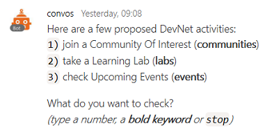

# Lauzhack 2017 - http://lauzhack.com/

**[join DevNet - Cisco's Developer Program](https://developer.cisco.com/join/)** to access Cisco Dev Centers, API learning resources, sandboxes and receive our newsletter.

## Coding Challenge

Invent a new Hospital experience: leverage next generation collaboration tools to optimize the journey of patients and doctors

### Schedule

- Saturday, 11h20: Cisco Workshop

- Saturday, 12h00: Cisco CMX Challenge starts

- till Sunday, 12h00: Coding time... make sure to [submit your hack by 11AM on saturday](), we'll come back to you with a slot to pitch (check below)

- Sunday, 12h15: Pitches at the Cisco booth
   - 3' pitch, 5' questions
   
   - **12h15: Team A**
   - **12h25: Team B**
   - **12h35: Team C**
   - **12h45: Team D**
   - **12h55: Team E**

- Saturday, 13h30: Winner announced at Cisco booth

### Support 

Simply reach to the Cisco booth on-site, or fill in your [email here](https://eurl.io/#HkCI0ZR0) to join the Cisco Spark "LauzHack - Cisco challenge - Tech Support" space.

### Judging criteria

- best user experience
- usage of Spark messages or Spark videos or both capabilities (both is better)
- code pushed on a public repo with explanations, a few snaphsots and an opensource license

### Cisco Spark API resources

- [Spark for Developers](https://developer.ciscospark.com): REST API documentation
- [awesome-ciscospark](https://github.com/CiscoDevNet/awesome-ciscospark)
- ["Create a Conversational Bot" learning lab](https://learninglabs.cisco.com/tracks/collab-cloud/spark-apps/collab-spark-botkit/step/1)

