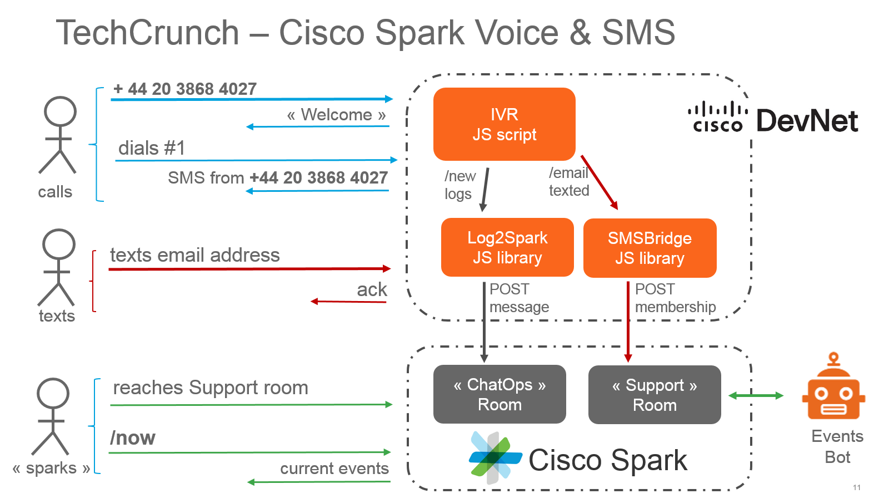

# Cisco Spark & DevNet presence at TechCrunch Disrupt 2016 (london, Dec 3rd,4th)

**4,000$ cash prize for Best use of Cisco’s Cloud Collaboration APIs**

see hackathon rules and [submit your hack](https://disrupteu2016.devpost.com/) 

Check these [Developer Resources](https://github.com/ObjectIsAdvantag/hackathon-resources#cisco-spark-cloud-collaboration-APIs) to build your awesome hack!

## Techcrunch SMS Bridge

Join the Cisco Spark support room by texting your email.

Get inspiration from this [Tropo script](smsbridge.js) that bridges from an email text'ed to a Cisco Spark room

 